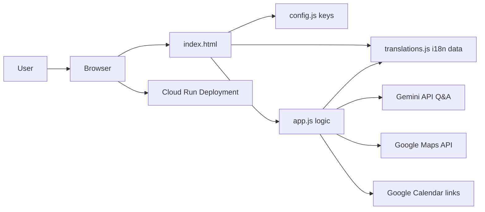

# ElectIQ — Civic Election Intelligence Assistant

[](https://developer.mozilla.org/en-US/docs/Web/HTML)
[](https://developer.mozilla.org/en-US/docs/Web/CSS)
[](https://developer.mozilla.org/en-US/docs/Web/JavaScript)
[](#testing)
[](https://www.w3.org/WAI/standards-guidelines/wcag/)
[](https://cloud.google.com/run)

## Problem Statement

> Create an assistant that helps users understand the election process, timelines, and steps in an interactive and easy-to-follow way.

## Live Demo

Deployment URL: `https://YOUR-CLOUD-RUN-URL.a.run.app`

## Solution Overview

ElectIQ is a mobile-first civic education web app for Indian voters that transforms election procedures into an interactive flow with multilingual guidance, eligibility checks, timeline reminders, an EVM simulator, and AI-assisted Q&A. It is faster to load than framework-heavy alternatives, works with static delivery, and maintains resilient behavior through local hardcoded knowledge fallback when APIs are unavailable.

## Features

| Feature | Description |
|---------|-------------|
| 5-Step Wizard | Guided flow for location, election timeline, eligibility, polling process, and post-vote outcomes |
| EVM Simulator | Interactive Electronic Voting Machine + VVPAT experience with realistic 7-second slip display |
| Election Quiz | 10-question exam with timed progression, explanations, and badge tiers |
| Encyclopedia | Searchable, categorized election knowledge base with myths vs facts |
| Multilingual | 8-language hardcoded i18n with runtime font switching and state-based auto-detect |
| Q&A Assistant | 3-level answer pipeline: local knowledge, Gemini API, graceful fallback |
| I Voted Card | Canvas-based downloadable social card in selected language |
| Maps Integration | Google Places autocomplete, state extraction, polling station context |
| Calendar Integration | One-click Google Calendar event creation for election milestones |

## Google Services Used

| Service | How Used | Why Meaningful |
|---------|----------|----------------|
| Gemini 2.5 Flash | Live Q&A chatbot + fallback-aware response path | Gives contextual election answers while preserving domain limits |
| Maps JavaScript API | Address autocomplete, state detection, booth context | Reduces confusion and improves local relevance |
| Google Calendar API | Event template links for key election milestones | Helps voters remember deadlines and election day |
| Google Fonts | Civic typography system across Indic scripts | Improves readability and localization quality |
| Google Cloud Run | Containerless deployment target | Fast static serving with minimal ops overhead |

## Architecture



## Security

| Layer | Protection | Implementation |
|-------|------------|----------------|
| API Keys | Secret Manager + .gitignore | `config.js` excluded from commit |
| Input | XSS sanitization | `sanitize()` in `app.js` for user-provided content |
| Rate Limiting | 10 req/session | Built into Q&A module |
| CSP | Content Security Policy | Meta CSP in `index.html` |
| Referrer | Domain restriction | Google Cloud Console API key restrictions |

## Multilingual Support

ElectIQ supports 8 languages: English, Hindi, Tamil, Telugu, Kannada, Malayalam, Bengali, and Marathi.  
It uses hardcoded JSON translations for reliability and offline safety, auto-detects suggested language from Maps state data, and swaps script-specific Noto Sans families at runtime.

## Testing

ElectIQ includes 50+ tests in `tests.js`.  
Run with browser URL flag: `?debug=true`

Covered categories:
- Sanitization
- Translations
- Config
- Calendar
- Quiz
- Demo Q&A
- Language Detection
- Accessibility

## Setup Instructions

1. Clone repository.
2. Create `config.js` in project root (same directory as `index.html`).
3. Add valid Google API keys to `config.js`.
4. Install server dependency: `npm install`.
5. Start server locally: `npm start`.
6. Open `http://localhost:8080`.
7. Run tests using `?debug=true`.

## Deployment (Google Cloud Run)

```bash
git stash
git pull
cat > config.js << EOF
const CONFIG = {
  GEMINI_API_KEY: "your-key",
  MAPS_API_KEY: "your-key",
  CALENDAR_API_KEY: "your-key"
};
EOF
gcloud run deploy electiq \
  --source . \
  --region us-central1 \
  --allow-unauthenticated
```

## Assumptions

- `config.js` is provided at deploy/runtime and excluded from git.
- Google Maps key has Places API enabled and domain restrictions configured.
- Gemini API access is enabled for the configured project.
- Users may run in demo mode when Gemini key is absent.
- Calendar integration uses template links without OAuth.

Built for Hack2Skill PromptWars 2026