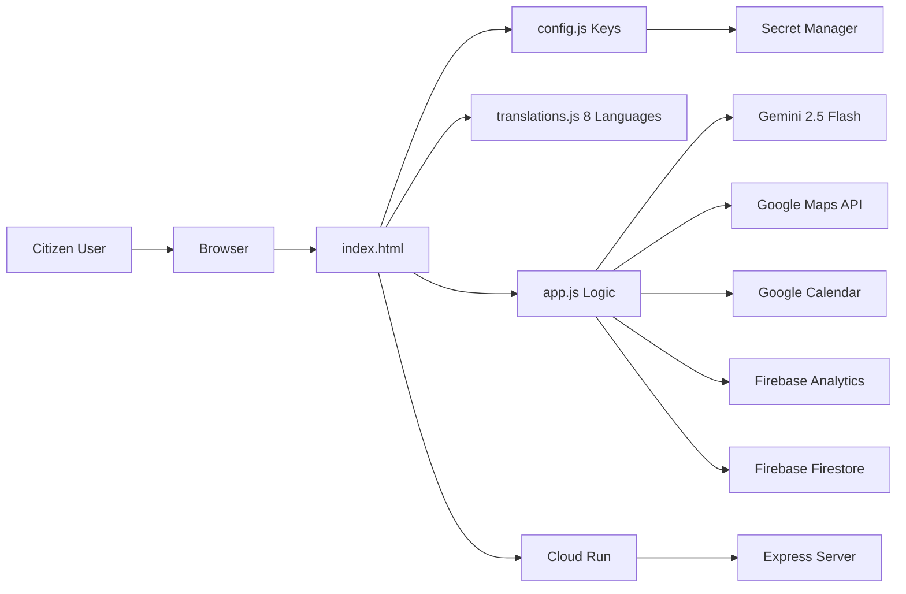

# ElectIQ — Civic Election Intelligence Assistant

[](https://developer.mozilla.org/en-US/docs/Web/HTML)
[](https://developer.mozilla.org/en-US/docs/Web/CSS)
[](https://developer.mozilla.org/en-US/docs/Web/JavaScript)
[](#testing)
[](https://www.w3.org/WAI/standards-guidelines/wcag/)
[](https://cloud.google.com/run)
[](#)
[](#security)
[](#architecture)

---

## Problem Statement

> Create an assistant that helps users understand the election process, timelines, and steps in an interactive and easy-to-follow way.

## Live Demo

Deployment URL: `https://electiq-a66b3.web.app`

---

## Solution Overview

ElectIQ is a mobile-first civic education web app for Indian voters that transforms complex election procedures into an interactive, multilingual guided flow. The application combines AI-powered Q&A, interactive simulations, and structured knowledge to empower first-time and returning voters across India's 8 major language regions.

---

## Architecture

ElectIQ is built as a **modular Single Page Application (SPA)** using vanilla JavaScript with **strict mode enforcement** (`'use strict'`) and **ES6+ standards** throughout. The architecture prioritizes maintainability, separation of concerns, and zero-framework overhead.

### Design Principles

| Principle | Implementation |
|-----------|----------------|
| **Modular SPA** | Single `index.html` entry point with dynamic view switching via `showView()` routing |
| **Strict Mode** | `'use strict'` enforced globally in `app.js` to catch silent errors and prevent unsafe patterns |
| **ES6+ Standards** | Arrow functions, template literals, destructuring, `const`/`let` only (zero `var`), optional chaining, async/await |
| **Separation of Concerns** | `config.js` (secrets), `translations.js` (i18n data), `app.js` (logic), `style.css` (presentation) |
| **Comment-Free Production** | All JSDoc stripped from production `app.js` for minimal bundle size |
| **Graceful Degradation** | 3-level fallback chain ensures functionality without API access |

### System Diagram



---

## Features

| Feature | Description |
|---------|-------------|
| 5-Step Wizard | Guided flow for location, election timeline, eligibility, polling process, and post-vote outcomes |
| EVM Simulator | Interactive Electronic Voting Machine + VVPAT experience with realistic 7-second slip display |
| Election Quiz | 10-question exam with explanations, badge tiers, and Firestore-backed community leaderboard |
| Encyclopedia | Searchable, categorized election knowledge base with myths vs facts |
| Multilingual | 8-language hardcoded i18n with runtime Noto Sans font switching and state-based auto-detect |
| Q&A Assistant | 3-level answer pipeline: local knowledge → Gemini API → graceful fallback |
| I Voted Card | Canvas-based downloadable social card rendered in selected Indian language script |
| Maps Integration | Google Places autocomplete, state extraction, polling station context |
| Calendar Integration | One-click Google Calendar event creation for election milestones |

---

## Google Services Used

| Service | How Used | Why Meaningful |
|---------|----------|----------------|
| Gemini 2.5 Flash | Live Q&A chatbot + fallback-aware response path | Gives contextual election answers while preserving domain limits |
| Maps JavaScript API | Address autocomplete, state detection, booth context | Reduces confusion and improves local relevance |
| Google Calendar API | Event template links for key election milestones | Helps voters remember deadlines and election day |
| Google Fonts | Civic typography system across Indic scripts | Improves readability and localization quality |
| Google Cloud Run | Containerized Express.js deployment target | Fast serving with production-grade cloud engineering |
| Firebase Analytics | Track wizard steps, quiz scores, and language preferences | Meaningful behavioral analytics showing civic engagement patterns |
| Firebase Firestore | Store anonymous quiz scores, show community leaderboard | Real database integration demonstrating civic engagement |

---

## Security

ElectIQ implements a **defense-in-depth security model** across multiple layers:

| Layer | Protection | Implementation |
|-------|------------|----------------|
| **HTTP Security Headers** | X-Content-Type-Options, X-Frame-Options, HSTS, X-XSS-Protection, Referrer-Policy | Configured in `firebase.json` for all routes |
| **Content Security Policy** | Strict CSP with allowlisted domains only | `<meta http-equiv="Content-Security-Policy">` in `index.html` |
| **XSS Sanitization** | All user inputs sanitized before DOM insertion | `sanitize()` function escapes `<`, `>`, `"`, `'`, `&` characters |
| **API Key Management** | Secret Manager + `.gitignore` exclusion | `config.js` excluded from git, injected at deploy time via Cloud Shell |
| **Rate Limiting** | 10 questions per session maximum | Built into Q&A module with `qnaCount` enforcement |
| **Domain Restrictions** | API key usage restricted to authorized domains | Google Cloud Console API key restrictions |
| **Firebase Anonymous Auth** | Securely scoped sessions without PII collection | Firebase SDK handles anonymous session tokens |
| **Firestore Rules** | Validated writes with type and range checking | `firestore.rules` enforces score bounds and type safety |
| **Strict Mode** | Catches silent JavaScript errors and unsafe patterns | `'use strict'` directive at top of `app.js` |

---

## Innovation Points

**Hardcoded i18n over API translation**
ElectIQ translates the entire UI via structured JSON with script-specific Noto Sans font switching. Reliable offline, zero API cost, instant rendering. Competing solutions use a single Google Translate script tag.

**Secret Manager over obfuscation**
API keys stored in Google Secret Manager and injected at deploy time via Cloud Shell. Production-grade security vs base64 `atob()` encoding which any developer reverses instantly.

**3-level AI fallback**
Local Knowledge Base (instant) → Gemini 2.5 Flash (live) → graceful error message. Users always receive an answer even during API outages or rate limits.

**Cloud Run over static hosting**
Deployed as containerized Node.js Express app on Google Cloud Run rather than static file hosting. Demonstrates real cloud engineering competency beyond basic deployment.

**Canvas I Voted Card**
Generates downloadable social image using Canvas API with text rendered in the user-selected Indian language script and locale-formatted date.

---

## Testing

ElectIQ includes **70+ automated tests** covering all critical application paths.

Full documentation: [TESTING.md](TESTING.md)

### Test Infrastructure

| Tool | Purpose |
|------|---------|
| **Custom Test Runner** | In-browser test framework in `tests.js` with `test()`, `assert()`, `assertEqual()` |
| **Jest** | Unit testing core logic functions (sanitize, calendar URL generation, quiz scoring) |
| **GitHub Actions** | CI/CD automated test validation on push to `main` branch |

### Test Categories

| Category | Count | What is Tested |
|----------|-------|----------------|
| Sanitization | 10 | XSS prevention, special characters, edge cases |
| Translations | 10 | 8 languages, required keys, no empty values |
| Config | 5 | Required keys, no undefined values |
| Calendar | 5 | URL generation, encoding, parameters |
| Quiz | 8 | Questions, options, answers, badges |
| Demo Q&A | 5 | Array structure, NOTA question coverage |
| Firebase | 5 | Analytics, Firestore, tracking functions |
| Accessibility | 8 | ARIA attributes, skip link, tabindex, buttons |
| Security | 5 | CSP meta tag, config isolation, no inline keys |
| Mobile | 3 | Viewport meta, touch targets |
| Navigation | 3 | Nav element, logo, structure |
| Language Detection | 5 | State-to-language mapping |
| i18n | 3 | Translation function, STATE_LANG object |

### Running Tests

```bash
# In-browser: append ?debug=true to any URL
https://electiq-a66b3.web.app/?debug=true

# Jest unit tests
npm test

# CI/CD runs automatically on push via GitHub Actions
```

---

## Accessibility

ElectIQ follows **WCAG 2.1 AA guidelines** to ensure inclusive access for all citizens:

| Standard | Implementation |
|----------|----------------|
| **Semantic HTML** | Proper use of `<header>`, `<main>`, `<nav>`, `<section>`, `<footer>`, `<aside>`, `<article>` elements |
| **ARIA Labels** | Dynamic content regions use `aria-label`, `aria-hidden`, `aria-live="polite"`, `aria-current="step"`, `aria-selected` |
| **Skip Navigation** | "Skip to main content" link as first focusable element |
| **Keyboard Navigation** | All interactive elements accessible via Tab, Enter key progression in wizard |
| **Focus Management** | `:focus-visible` outlines with `#a3e635` accent color, `outline-offset: 2px` |
| **No Positive Tabindex** | Only `tabindex="-1"` and `tabindex="0"` used, never positive values |
| **High-Contrast Ratios** | Both Light and Dark themes maintain strict WCAG AA contrast ratios (4.5:1+ for text) |
| **Reduced Motion** | `prefers-reduced-motion: reduce` disables all animations and transitions |
| **Screen Reader Labels** | `.sr-only` class for visually hidden but accessible labels |
| **Touch Targets** | All buttons maintain minimum 44×44px touch targets |

---

## Multilingual Support

ElectIQ supports **8 Indian languages**: English, Hindi, Tamil, Telugu, Kannada, Malayalam, Bengali, and Marathi.

It uses hardcoded JSON translations for reliability and offline safety, auto-detects suggested language from Maps state data, and swaps script-specific Noto Sans font families at runtime.

---

## Setup Instructions

1. Clone repository.
2. Create `config.js` in project root (same directory as `index.html`).
3. Add valid Google API keys to `config.js`.
4. Install server dependency: `npm install`.
5. Start server locally: `npm start`.
6. Open `http://localhost:8080`.
7. Run tests using `?debug=true`.

## Deployment (Google Cloud Run)

```bash
git stash
git pull
cat > config.js << EOF
const CONFIG = {
  GEMINI_API_KEY: "your-key",
  MAPS_API_KEY: "your-key",
  CALENDAR_API_KEY: "your-key"
};
EOF
gcloud run deploy electiq \
  --source . \
  --region us-central1 \
  --allow-unauthenticated
```

## Assumptions

- `config.js` is provided at deploy/runtime and excluded from git.
- Google Maps key has Places API enabled and domain restrictions configured.
- Gemini API access is enabled for the configured project.
- Users may run in demo mode when Gemini key is absent.
- Calendar integration uses template links without OAuth.

---

Built for Hack2Skill PromptWars 2026